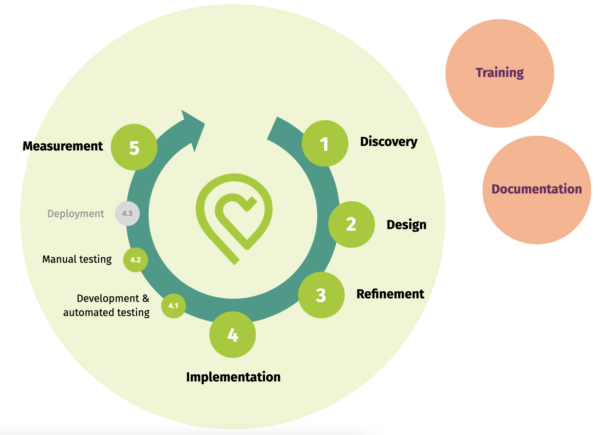

# Accessibility workflow at betterplace

Accessibility (a11y) has to be incorporated into different work steps of our workflow.

## 1. Discovery

- 🚧 Use a11y metrics (score?, number of critical issues?)

_In a later expansion stage_

- Interview people with disabilities to get a better understanding of their problems and needs.

## 2. Design

- Use [checklist](https://not-checklist.intopia.digital/) (filtered by job roles _Visual Design_, _Content Design_ and _UX Design_) to make sure the design is accessible.
- 🚧 Make annotations to pass on a11y considerations to engineers.

_In a later expansion stage_

- Use design system to reuse accessible styles and components.

## 3. Refinement

- Use [checklist](https://not-checklist.intopia.digital/) to make sure the planned implementation considers a11y.
- 🚧 Define a11yAC’s

## 4. Implementation

### 4.1 Development & Automated testing

- Use [linter](https://www.npmjs.com/package/eslint-plugin-jsx-a11y) and [logging to the browser's console](https://www.npmjs.com/package/@axe-core/react) to catch and fix a11y issues early.
- Read a11yAC’s (and eventually have a look at the [checklist](https://not-checklist.intopia.digital/) again) to know what to code and how to test.
- Follow coding standards to avoid minor recurring a11y problems.

_In a later expansion stage_

- Use design system to reuse accessible styles and components.
- Add automated tests considering keyboard and screen reader usage

### 4.2 Manual testing

- Read a11yAC’s to know what to test and how.
- Follow [manual testing guidelines](../testing_guide.stories.mdx)

## 5. Measurement

- 🚧 Use a11y metrics (score?, number of critical issues?)

_In a later expansion stage_

- Perform UX Tests or other UX research methods with people with disabilities.

## Training

- Provide [A11y knowledge base](./accessibility_knowledge_base.md)
- 🚧 Share (basic) a11y knowledge in initial meetings / workshops

_In a later expansion stage_

- Regularly share a11y knowledge / discuss a11y topics in different meetings (Tech Talk, Sprint Review, …)

## Documentation

- Keep documentation up to date

_In a later expansion stage_

- Build accessible design system.
- Derive a11yAC templates from a11yAC’s.
